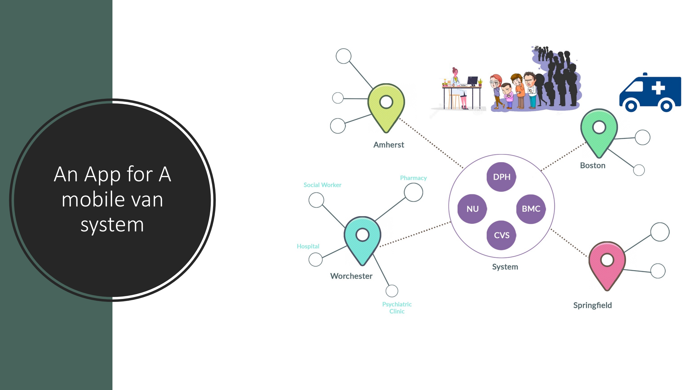
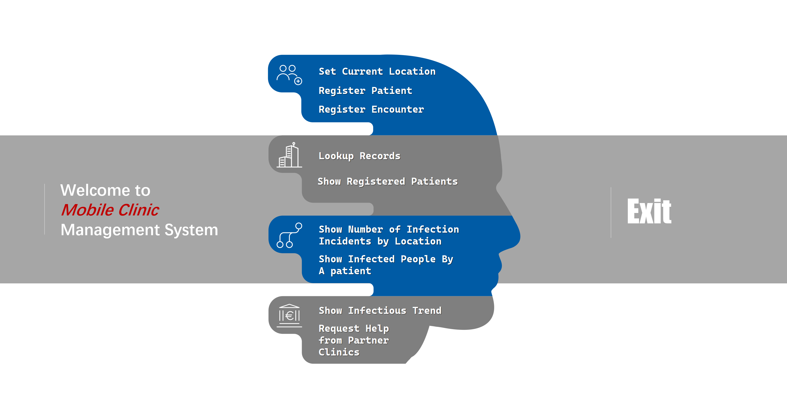

<h1 align="center"> MobileClinic_Manager</h1>

A Mobile Clinic Management System as the final project of NEU course INFO5001 Application Modeling and Design.  

<!-- TOC -->
* [📑 Overview](#-overview)
* [💻 Environment](#-environment)
* [🛠 Installation](#-installation)
* [🚀 Technologies](#-technologies)
<!-- TOC -->

# 📑 Overview
Created an app for a moving clinic that helps the homeless in different towns. It also keeps an eye on spreading diseases like HIV. The clinic team travels to cities and towns, and this app completes the system design and fills it with info about patients with various illnesses. It's got these features:
1. Easily find sick patients and where they were last.
2. Track patients who might have spread illnesses to others.
3. See how many people are affected in each place and the trend over time.
4. Include local services like mental health care to help sick patients better.
### Preview

# 💻 Environment
swing tutorial [Getting Started]([https://openjfx.io/openjfx-docs/](https://www.javatpoint.com/java-swing))

# 🛠 Installation
Clone the repository into your local machine

# 🚀 Technologies
This project was developed with the following technologies:
- Java
- Swing
- VScode
  
OOP concepts used:
- Classes and Objects/Overloading and Overriding
- Encapsulation/Inheritance/Polymorphism
- Abstraction/Interfaces

Data structure used:  
- Lists, Stacks, Queues/Priority Queues, Set/MapsGraph

Other tools used:  
- Git&GitHub
- Google Drive
- Trello team/tasks management

[⬆ Back to the top] 
